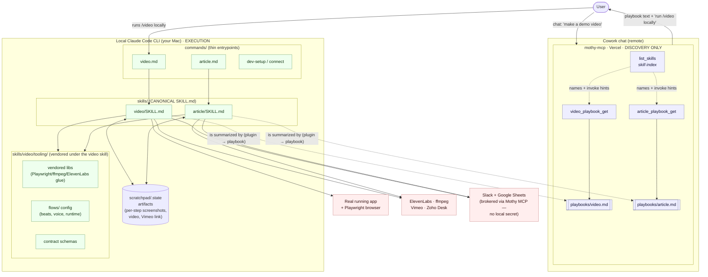

# Mothy: two-surface architecture

Mothy ships as **two cooperating surfaces** that must never be confused:

| Surface | Where it runs | Role | Repo |
| --- | --- | --- | --- |
| **mothy PLUGIN** | Local Claude Code CLI on your Mac | **Execution.** Drives the real app, real browser, real credentials, ffmpeg, and the network APIs. Produces artifacts. | `mothy-plugins/plugins/mothy` |
| **mothy-mcp** | Vercel (remote, Cowork chat) | **Discovery only.** Serves playbook text and a skill index so a chat client can *find* a capability and point you at the local command. Runs nothing. | `mothy-mcp` |

The hard rule that keeps these from drifting:

> **One-directional canonicity.** The plugin `SKILL.md` is the single source of
> truth for *how* a flow actually executes. The MCP playbook is a **discovery
> summary** of that skill — it describes the capability and ends by pointing the
> user at the local command (e.g. "run `/video` in Claude Code"). The playbook
> never executes, never re-implements steps, and is allowed to lag/abbreviate.
> When they disagree, the plugin `SKILL.md` wins. Edits flow plugin → playbook,
> never the reverse.

---

## Diagram

---

## Boundary map

### Surface 1 — the mothy PLUGIN (local execution)

Layered, each layer thinner than the one below it:

1. **`commands/{video,article,…}.md`** — thin entrypoints. Frontmatter
   `description` + `argument-hint`; body just invokes the matching skill with
   `$ARGUMENTS` and a one-line guardrail (e.g. "confirm scope before capturing",
   "always a Draft, never auto-publish"). No logic lives here.

2. **`skills/{video,article,…}/SKILL.md`** — **canonical** orchestration. The
   full playbook of how a flow executes: beats, capture loop, voiceover,
   assembly, delivery, the credential resolution order, and the contract it
   honors. This is the source of truth the MCP playbook merely summarizes.

3. **`skills/video/tooling/`** — vendored implementation, scoped **under the
   video skill** (a subdir, never a sibling skill dir, never `skills/_shared/`):
   - vendored libs (Playwright / ffmpeg / ElevenLabs glue),
   - `flows/` config (per-flow beat list, voice, target runtime, splash),
   - contract schemas the skill validates against.

   The `article` skill reuses these via the same path — it consumes what a
   `/video` run already captured rather than re-implementing capture.

4. **`scratchpad/.state` artifacts** — the read/write substrate between steps
   and between skills. `/video` writes per-step screenshots + the assembled
   video + the Vimeo link; `/article` reads those same artifacts to build the
   Zoho Desk Draft. State is the hand-off; neither skill re-derives the other's
   output.

**External edges (local only):** the real running app + a real Playwright
browser, plus ElevenLabs / ffmpeg / Vimeo / Zoho Desk over the network. These
need a real machine and local credentials — they are why this surface cannot run
in Cowork. **Slack and Google Sheets are the exception:** they are brokered
through the Mothy MCP, so the plugin holds no Slack/Sheets secret locally.

### Surface 2 — mothy-mcp (Vercel, discovery only)

- **`list_skills`** — enumerates available skills with names + `invoke` hints
  (e.g. `video_playbook_get (then run /video locally)`). The chat's "what can
  you do" entrypoint.
- **`video_playbook_get` → `playbooks/video.md`** and
  **`article_playbook_get` → `playbooks/article.md`** — serve the playbook text.
  Each playbook leads with "this runs in your local Claude Code CLI — NOT here in
  Cowork" and ends by pointing at the local `/video` · `/article` command.

The MCP **serves text and nothing more.** It does not touch a browser, ffmpeg,
or the local filesystem; it cannot produce a video or an article.

---

## Demo-capture access note

The capture path needs **no CommandIQ repo access.** `/video` logs into the
deployed dev app as the demo-capture user and drives it through Playwright like
any user would. No source checkout, no build of the target app — just a login
and a browser. The demo data is anonymized and PII-safe.
