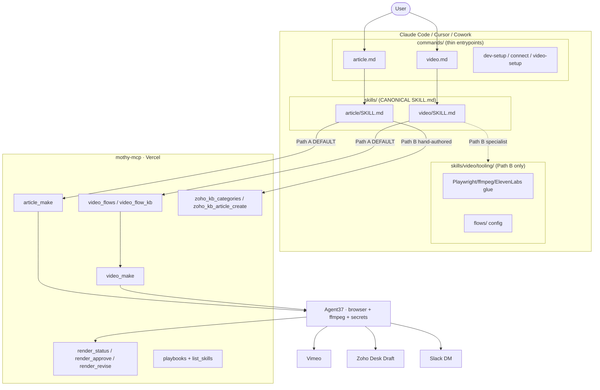

# Mothy: two-surface architecture

Mothy ships as **two cooperating surfaces** that must never be confused:

| Surface | Where it runs | Role | Repo |
| --- | --- | --- | --- |
| **mothy PLUGIN** | Local Claude Code / Cursor on your machine | **Orchestration + local specialist tooling.** Slash commands + skills. Default `/video` + `/article` call mothy MCP remote renders; Path B keeps the local Playwright/ffmpeg/ElevenLabs capture rig for offline/specialist use. | `mothy-plugins/plugins/mothy` |
| **mothy-mcp** | Vercel (remote) + **Agent37** for demo renders | **Discovery + remote execution for demo video/article.** Serves playbooks/indexes **and** queues `video_make` / `article_make` jobs that run on Agent37 (browser, ffmpeg, ElevenLabs, Vimeo, Zoho secrets stay there). | `mothy-mcp` |

The hard rule that keeps skill prose honest:

> **One-directional canonicity.** The plugin `SKILL.md` is the single source of
> truth for *how* a flow should be driven from the client. The MCP playbook
> summarizes it. When they disagree, the plugin `SKILL.md` wins. Edits flow
> plugin → playbook, never the reverse.
>
> **Execution split for video/article:** production Path A is **remote Agent37**
> via `video_make` / `article_make`. Local Path B tooling under
> `skills/video/tooling/` remains for specialist/offline capture — demoted, not
> deleted. `agent37_exec` is admin diagnostics, not the user-facing default.

---

## Diagram

---

## Boundary map

### Surface 1 — the mothy PLUGIN (client orchestration)

1. **`commands/{video,article,…}.md`** — thin entrypoints. Frontmatter
   `description` + `argument-hint`; body invokes the matching skill. No logic.

2. **`skills/{video,article,…}/SKILL.md`** — **canonical** orchestration.
   Path A (remote) is default; Path B documents local capture for specialists.

3. **`skills/video/tooling/`** — vendored **Path B** implementation under the
   video skill (never a sibling skill): Playwright/ffmpeg/ElevenLabs glue,
   flow configs, schemas. `/article` Path B may reuse artifacts from a local
   `/video` Path B run via scratchpad state.

4. **`scratchpad/.state`** — Path B hand-off between local `/video` and
   `/article`. Path A hand-off is `job_id` / `vimeo_id` via MCP.

### Surface 2 — mothy-mcp (+ Agent37 for renders)

- **Discovery:** `list_skills`, `video_playbook_get`, `article_playbook_get`,
  `video_flows`, `video_flow_kb`, `video_flow_request`, `commandiq_repo_intel`.
- **Remote execution (Path A):** `video_make` / `article_make` → `job_id`;
  poll `render_status`; QA with `render_approve` / `render_revise` when
  `awaiting_qa`. Agent37 holds ElevenLabs / Vimeo / Zoho / demo-capture secrets.
- **Hand-authored KB (article Path B):** `zoho_kb_categories` →
  `zoho_kb_article_create` (Draft-only, server-side Zoho).
- **Admin only:** `agent37_exec` allowlisted diagnostics — not the default
  `/video` or `/article` path.

Slack and Sheets remain MCP-brokered (no local Slack/Sheets secret).

---

## Demo-capture access note

Path A needs **no local CommandIQ repo, no local ffmpeg, no local API keys.**
Path B (when used) logs into the deployed dev app as the demo-capture user and
drives it through Playwright; demo data is anonymized and PII-safe.
